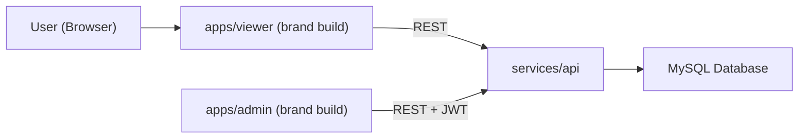

**Wellspace** is an open platform for participatory **spatial wellbeing** mapping: visitors place pins on interactive 3D campus models and answer configurable questionnaires.

This **monorepo** hosts the shared viewer (`apps/viewer`), admin (`apps/admin`), and PHP API (`services/api`), plus **`brands/`** for site-specific deployments. **End users still only see product brands**, for example:

- **wohlOpti** and **feelvonRoll** deployments (themes, domains, wording, models, Plausible keys, …)
- Additional projects can ship as further brand folders without renaming the codebase

The **feelvonRoll** strand is developed as part of [**RealTransform**](https://sustainability.uzh.ch/de/forschung-lehre/forschung/realtransform.html) at [PHBern](https://www.phbern.ch): an interactive wellbeing installation on the [vonRoll campus](https://www.phbern.ch/ueber-die-phbern/standorte/vonroll).

> **GitHub:** The canonical source for this codebase is migrating to **Wellspace** wording; the Git remote may still show `feelvonroll` until the repository slug is renamed. Local clone folder names are arbitrary (`wellspace/` is recommended).

## Architecture



The **viewer** loads a tenant-specific theme from `brands/<brand>/` and talks to the API via `VITE_API_BASE`. The **admin** panel manages pins, questions, questionnaires, stations, users, translations, optional LV95 calibration, etc.

## Prerequisites

- [Node.js](https://nodejs.org/) ≥ 20
- [pnpm](https://pnpm.io/) 10 (see root `packageManager`)
- PHP ≥ 8.1 and Composer (for API)
- MySQL or MariaDB

## Getting Started

Clone (replace URL if GitHub slug is renamed to `wellspace`):

```bash
git clone https://github.com/lbatschelet/feelvonroll.git wellspace
cd wellspace
pnpm install
```

### API (`services/api`)

```bash
cd services/api
mysql -u root your_db_name < schema.sql
cp config.example.php config.local.php
# Edit config.local.php: DB credentials, jwt_secret, admin_token; optional SMTP, GitHub

php -S localhost:8080
```

> Existing databases: apply only migrations you have not yet run under `services/api/migrations/`, in numeric order.

### Viewer

```bash
pnpm --filter viewer dev
```

Override API base via `apps/viewer/.env.local` when needed:

```
VITE_API_BASE=http://localhost:8080
```

### Admin

```bash
pnpm --filter admin dev
```

Same `VITE_API_BASE` pattern under `apps/admin/.env.local` if required.

### Production build (pnpm at repo root)

```bash
BRAND=feelvonroll pnpm build
BRAND=wohlopti pnpm build
```

## Testing

```bash
pnpm test
```

For API only:

```bash
cd services/api && composer test
```

## Deployment

GitHub Actions support building `feelvonroll` / `wohlopti` and publishing Hostinger-style deploy branches. See `.github/workflows/`.

Deploy the PHP API beside the static apps; frontends resolve the API URL from brand config unless overridden at build time.

## Model pipeline (3D)

`model-pipeline/campus/` — Sweet Home 3D → OBJ → GLB; export assets under `brands/<brand>/viewer/public/models/` (see `model-pipeline/campus/00_README.md`).

### Email (SMTP) for password reset

Requires `composer install` in `services/api` where PHPMailer is used. Defaults in docs and templates use platform-facing **Wellspace** naming; overrides live in `config.local.php`:

| Setting           | Meaning |
|-------------------|---------|
| `smtp_from_name` | Display name (e.g. `Wellspace Admin`) |
| `app_url`        | Admin base URL for reset links |

## Project structure

```
wellspace/
  apps/
    viewer/           Vite + Three.js public app
    admin/            Vite + vanilla JS admin UI
  services/
    api/             PHP endpoints, services/, schema.sql, migrations/
  brands/
    feelvonroll/     feelvonRoll deployment assets & config.js
    wohlopti/        wohlOpti deployment assets & config.js
  packages/           Shared tooling (if any)
  infra/              Deploy build helpers, Vite brand resolution
  model-pipeline/     Campus GLB toolchain
```

## License

This repository (**Wellspace** platform codebase) is licensed under the [GNU Affero General Public License v3.0](LICENSE).

## Credits

Developed by [Lukas Batschelet](https://lukasbatschelet.ch). Product deployments such as feelvonRoll are built for partners including [PHBern](https://www.phbern.ch) within [RealTransform](https://sustainability.uzh.ch/de/forschung-lehre/forschung/realtransform.html).
