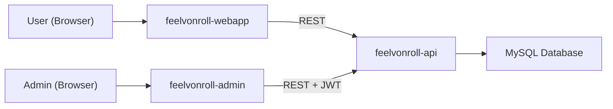

An interactive wellbeing mapping tool for the [vonRoll campus](https://www.phbern.ch/ueber-die-phbern/standorte/vonroll) at [PHBern](https://www.phbern.ch). Visitors place pins on a 3D model of the building to share how they feel in different spaces -- and why.

*feel***vonRoll** is developed as part of [**RealTransform**](https://sustainability.uzh.ch/de/forschung-lehre/forschung/realtransform.html), a cross-university project funded by [swissuniversities](https://www.swissuniversities.ch/) that fosters sustainability culture at Swiss higher education institutions through participatory real-world experiments. At PHBern, the project takes the form of [*Stationen des Wandels*](https://www.phbern.ch/ueber-die-phbern/bildung-fuer-nachhaltige-entwicklung/stationen-des-wandels-nachhaltigkeit-im-dialog) -- interactive installations that invite students, staff, and visitors to reflect on sustainability and wellbeing on campus.

## Components

The project consists of three components:

| Component                                                               | Stack             | Description                                                                      |
| ----------------------------------------------------------------------- | ----------------- | -------------------------------------------------------------------------------- |
| [feelvonroll-webapp](https://github.com/lbatschelet/feelvonroll-webapp) | Vite + Three.js   | Public-facing 3D webapp where users place pins                                   |
| [feelvonroll-api](https://github.com/lbatschelet/feelvonroll-api)       | PHP 8.1 + MySQL   | REST API for pins, questionnaires, stations, content, and translations           |
| [feelvonroll-admin](https://github.com/lbatschelet/feelvonroll-admin)   | Vite + vanilla JS | Admin panel for pins, questions, questionnaires, stations, users, and content    |

The **main repository** also contains **`model-pipeline/`** (not a submodule): scripts and source assets to export the campus building from Sweet Home 3D to GLB files consumed by the webapp under `feelvonroll-webapp/public/models/`.

## Architecture



The **webapp** lets visitors navigate a 3D model of the vonRoll building, select a location, and fill out a dynamic questionnaire (wellbeing slider, multiple-choice reasons, free text). QR-code stations can pre-position the camera and assign a station-specific questionnaire. Submitted pins are stored via the **API** and colored by a configurable slider value.

The **admin panel** authenticates via JWT and provides tools to review/approve pins, manage a question library, compose questionnaires, configure QR-code stations, edit content pages, manage users and languages, and export data as CSV. It can also maintain an optional **LV95 calibration** (affine mapping from 3D capture points to Swiss coordinates) for GIS-style use of pin positions.

The **API** serves public endpoints (pins, questions, questionnaires, stations, content, languages, translations) and authenticated admin endpoints (full CRUD for all resources, user management, audit logging).

## Getting Started

### Prerequisites

- [Node.js](https://nodejs.org/) >= 18
- [PHP](https://www.php.net/) >= 8.1
- MySQL / MariaDB
- A web server with PHP support (Apache, Nginx, or PHP built-in server)

### Clone with submodules

```bash
git clone --recurse-submodules https://github.com/lbatschelet/feelvonroll.git
cd feelvonroll
```

If you already cloned without `--recurse-submodules`:

```bash
git submodule update --init --recursive
```

### 1. Set up the API

```bash
cd feelvonroll-api

# Create the database schema (consolidated, includes all migrations)
mysql -u root your_db_name < schema.sql

# Configure credentials
cp config.example.php config.local.php
# Edit config.local.php with your database credentials, jwt_secret, and admin_token

# Start a local PHP server (for development)
php -S localhost:8080
```

> **Upgrading an existing database?** Apply only the migrations you have not run yet from `migrations/`, in numeric order (filenames are numbered, e.g. `001_*.sql`, `011_*.sql`).

### 2. Start the webapp

```bash
cd feelvonroll-webapp
npm install
npm run dev
```

By default the webapp expects the API at `/api`. Override with a `.env.local` file:

```
VITE_API_BASE=http://localhost:8080
```

### 3. Start the admin panel

```bash
cd feelvonroll-admin
npm install
npm run dev
```

Override the API base the same way:

```
VITE_API_BASE=http://localhost:8080
```

## Testing

```bash
# Webapp tests
cd feelvonroll-webapp && npm test

# Admin tests
cd feelvonroll-admin && npm test

# API tests
cd feelvonroll-api && composer test
```

## Deployment

1. **API**: Upload `feelvonroll-api/` to your PHP hosting (e.g. `/api`). Ensure `config.local.php` is configured and not publicly accessible.
2. **Webapp**: Run `npm run build` in `feelvonroll-webapp/` and deploy the `dist/` folder to your web root.
3. **Admin**: Run `npm run build` in `feelvonroll-admin/` and deploy the `dist/` folder (e.g. to `/admin`).

Set `VITE_API_BASE` at build time if the API is not served from `/api`:

```bash
VITE_API_BASE=https://api.example.com npm run build
```

## Building model (3D pipeline)

The interactive map uses **glTF/GLB** models per floor (stacked in the scene). Source workflow:

1. Model in **Sweet Home 3D**, export as OBJ (zip with MTL/textures).
2. Scripts under `model-pipeline/campus/tools/`: unpack zip → `obj2gltf` → optional mesh optimization (`optimize_glb.mjs`), then copy GLBs into the webapp.
3. Detailed steps, folder layout, and slab-height notes: **`model-pipeline/campus/00_README.md`**.

Typical commands (from repo root):

```bash
./model-pipeline/campus/tools/unpack_floor_export_zip_to_latest.sh floor_0
./model-pipeline/campus/tools/convert_floor_obj_to_glb.sh floor_0
./model-pipeline/campus/tools/copy_glb_to_webapp.sh floor_0
```

### Email (SMTP) Setup

The admin panel can send password-reset emails. This requires an SMTP server.

1. **Install PHP dependencies** on the server (requires [Composer](https://getcomposer.org/)):

   ```bash
   cd feelvonroll-api
   composer install --no-dev
   ```

   > **Shared hosting**: If Composer is not available via SSH, run `composer install --no-dev` locally and upload the resulting `vendor/` directory to the server.

2. **Configure SMTP** in `config.local.php`:

   ```php
   'smtp_host'      => 'smtp.example.com',
   'smtp_port'      => 587,          // 587 for STARTTLS, 465 for SMTPS
   'smtp_user'      => 'you@example.com',
   'smtp_pass'      => 'your-smtp-password',
   'smtp_from'      => 'noreply@example.com',
   'smtp_from_name' => 'feelvonRoll Admin',
   'app_url'        => 'https://admin.example.com',
   ```

   | Setting | Description |
   | --- | --- |
   | `smtp_host` | SMTP server hostname |
   | `smtp_port` | `587` (STARTTLS) or `465` (SMTPS) -- the encryption method is chosen automatically |
   | `smtp_user` / `smtp_pass` | SMTP credentials |
   | `smtp_from` | Sender address shown in emails |
   | `smtp_from_name` | Sender display name |
   | `app_url` | Public URL of the admin frontend (used to build reset links) |

   Without SMTP configuration, the admin panel still works -- reset links can be generated and copied manually instead of being sent by email.

## Project Structure

```
feelvonroll/
  model-pipeline/           Campus 3D export (Sweet Home → OBJ → GLB); see campus/00_README.md
    campus/
      tools/                  unpack, convert, optimize, copy_glb_to_webapp scripts
  feelvonroll-webapp/       Public 3D webapp (Three.js)
    public/models/          Shipped GLB files (from the pipeline)
    src/
      main.js               Entry point, glTF building load, orbit controls, stations
      config.js             Camera/orbit tuning for imported models
      scene.js              Scene graph helpers
      floors.js             Floor index helpers (visibility, raycast plane)
      building/             glTF provider (stacked floors) and procedural fallback
      pins.js               Pin placement and visualization
      pins/                 Pin subsystems (form, mesh, clustering, …)
      ui/                   Questionnaire UI, floor selector, overlays
  feelvonroll-api/          PHP REST API
    pins.php                Public pin endpoints
    questions.php           Questionnaire config endpoint
    questionnaire.php       Resolve questionnaire by key
    stations.php            Station info endpoint
    content.php             Content page endpoint
    admin_auth.php          JWT authentication
    admin_pins.php          Pin management
    admin_users.php         User management
    admin_questionnaires.php Questionnaire & slot management
    admin_stations.php      Station management
    admin_content.php       Content page management
    services/               Business logic layer
    schema.sql              Consolidated database schema
    migrations/             Incremental SQL migration files
  feelvonroll-admin/        Admin panel (vanilla JS)
    src/
      main.js               Entry point, view assembly
      app/                  Shell, routing, initialization
      controllers/          Business logic controllers
      ui/                   View builders
      api/                  API client modules
      state/                Application state
```

## License

*feel***vonRoll** is licensed under the [GNU Affero General Public License v3.0](LICENSE).

## Credits

Developed by [Lukas Batschelet](https://lukasbatschelet.ch) for [PHBern](https://www.phbern.ch) as part of the [RealTransform](https://sustainability.uzh.ch/de/forschung-lehre/forschung/realtransform.html) project.

RealTransform is led by the University of Zurich in cooperation with the University of Bern, PHBern, and OST -- Ostschweizer Fachhochschule, with the support of the [td-net](https://transdisciplinarity.ch/) Network for Transdisciplinary Research.
